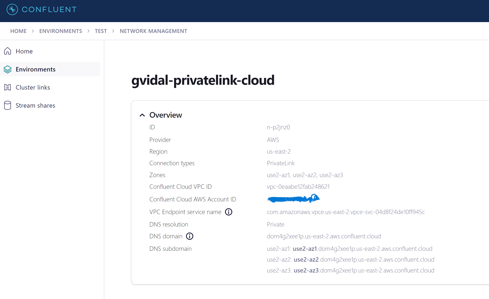
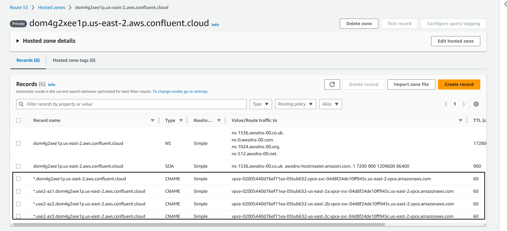

# How to Connect VPC To Private Link Confluent Cloud
You can use the following video to setup a private link network on Confluent Cloud and configure AWS Connection to Private Link Network. The video tutorial can be found at link below and should guide you throught the major portions of the configuration required.

(https://www.youtube.com/watch?v=Pb8_g5gylow)

During the course of the video, the steps to follow require information from various screens and webpages. These are the values from this tutorial, but will vary by your implementation.  Here are the key information required to complete this tutorial


### Values from Confluent Cloud Networking
```
### VPC Endpoint service name
com.amazonaws.vpce.us-east-2.vpce-svc-04d8f24de10ff945c

###  DNS SubDomains
use2-az1: use2-az1.dom4g2xee1p.us-east-2.aws.confluent.cloud
use2-az2: use2-az2.dom4g2xee1p.us-east-2.aws.confluent.cloud
use2-az3: use2-az3.dom4g2xee1p.us-east-2.aws.confluent.cloud

### Confluent Cloud VPC ID
vpc-0eaabe12fab248621
```


#### Values from Cluster Settings
```
### Bootstrap
lkc-kgowr6.dom4g2xee1p.us-east-2.aws.confluent.cloud:9092

### REST API 
https://lkc-kgowr6.dom4g2xee1p.us-east-2.aws.confluent.cloud:443

### Values from AWS

```
#### Values from AWS Private Link Endpoint Service

```
### Values from AWS Endpoint Service
### DNS names
vpce-02005440d76ef71ea-05tub632.vpce-svc-04d8f24de10ff945c.us-east-2.vpce.amazonaws.com
vpce-02005440d76ef71ea-05tub632-us-east-2a.vpce-svc-04d8f24de10ff945c.us-east-2.vpce.amazonaws.com
vpce-02005440d76ef71ea-05tub632-us-east-2b.vpce-svc-04d8f24de10ff945c.us-east-2.vpce.amazonaws.com
vpce-02005440d76ef71ea-05tub632-us-east-2c.vpce-svc-04d8f24de10ff945c.us-east-2.vpce.amazonaws.com
```
## 1. Create Confluent Cloud Network
https://youtu.be/Pb8_g5gylow?t=46




## 2. Create Private Link Endpoint Service
The following link provides a tutorial to follow for setting up the private link endpoint.
https://youtu.be/Pb8_g5gylow?t=114

- Be sure to capture the DNS Names you will need to link in your Route 53 Hosted Zone. 
- Be sure to modify security group for outbound traffic for ports `9092` and `443` of the private link endpoint.


## 3. Create Private Link Cluster

https://youtu.be/Pb8_g5gylow?t=219

Create a Private Link cluster.


## 4. Create Route 53 Hosted Zone (Important)
https://youtu.be/Pb8_g5gylow?t=307

Create CName records for domain and subdomains using public subnets from private link endpoint


## 5. Create/Configure Proxy EC2 Instance
https://youtu.be/Pb8_g5gylow?t=488

- Create a new EC2 Instance (Ubuntu) with a public IP
- Add Outbound rules to security-group for port `9092` and port `443`
- SSH into instance and install/configure nginx proxy configuration
- This strays from video which does not show you how to configure the proxy for our use case, so please follow steps below:

#### 5a. NGINX.conf in /etcd/nginx/nginx.conf

Install Nginx
```
sudo apt update
sudo apt install nginx
```

```bash
load_module /usr/lib/nginx/modules/ngx_stream_module.so;

stream {
        log_format basic '$remote_addr [$time_local] '
                '$protocol $status $bytes_sent $bytes_received '
                '$session_time "$upstream_addr" '
                '"$upstream_bytes_sent" "$upstream_bytes_received" "$upstream_connect_time"';
        map $ssl_preread_server_name $targetBackend {
                default $ssl_preread_server_name;
        }

        server {
                listen 9092;
			
                proxy_connect_timeout 60s;
                proxy_timeout 7200s;

                resolver 127.0.0.53;
		     
                proxy_pass $targetBackend:9092;
                
		     ssl_preread on;

		     #IP Filtering rules are order sensitive allow first, then deny all.
             #   allow 108.164.192.13/32;
             #   deny all;
                
	      access_log /var/log/nginx/access_9092.log basic;
              error_log /var/log/nginx/error_9092.log;
        }
        server {
                listen 443;

                proxy_connect_timeout 1s;
                proxy_timeout 7200s;
                resolver 127.0.0.53;

                proxy_pass $targetBackend:443;
                ssl_preread on;
        }
}
```

Stop and restart services

```
sudo systemctl start nginx
sudo systemctl status nginx
```

#### 5b. KCAT Command To Retrieve list of brokers and test connectivity
- Install Kafkacat

```bash
sudo apt install kafkacat
```

```bash
kafkacat \
    -X security.protocol=SASL_SSL \
    -X "sasl.username=IXWCJCOMJZDQHPWI" \
    -X "sasl.password=g1XITdfpVeAChuWW3bO38f37rxoT+Egw3pQj6avHwX3vGV8bkdgZZ/nMs1LSyxTl" \
    -X sasl.mechanisms=PLAIN \
    -X api.version.request=true \
    -b "lkc-kgowr6.dom4g2xee1p.us-east-2.aws.confluent.cloud:9092" \
    -L -J|jq -r '.brokers|.[]|.name' |sed -e 's/:*//'
```
### 6. Update your client hosts configuration files

Once you have a list of broker host names you can put them in your `/etc/host` or Windows Host file file on your client machine.    

```bash
# Bootstrap Host
18.189.231.86 lkc-kgowr6.dom4g2xee1p.us-east-2.aws.confluent.cloud
# Brokers
18.189.231.86 e-009c.use2-az1.dom4g2xee1p.us-east-2.aws.confluent.cloud
18.189.231.86 e-003c.use2-az1.dom4g2xee1p.us-east-2.aws.confluent.cloud
18.189.231.86 e-0381.use2-az1.dom4g2xee1p.us-east-2.aws.confluent.cloud
18.189.231.86 e-0398.use2-az1.dom4g2xee1p.us-east-2.aws.confluent.cloud
18.189.231.86 e-0a7e.use2-az1.dom4g2xee1p.us-east-2.aws.confluent.cloud
18.189.231.86 e-0ffb.use2-az1.dom4g2xee1p.us-east-2.aws.confluent.cloud
```
## 7. Check Web UI is visible
Topics should now show in the UI and red banner should disappear


## 8. Run your java/CLI Client to produce records
### 8a. Add a topic
Create a topic named `my-topic` under the topic tab

### 8a. Create an API Key
Once you create the API key it will be saved in your downloads folder which includes your api-key and secret


### 8b. Run a simple Java application
Once you have completed configuration you should be able to successfully produce/consume records from your client applications and view information on Confluent Cloud for topics.

```java
/*
 * Licensed to the Apache Software Foundation (ASF) under one or more
 * contributor license agreements.  See the NOTICE file distributed with
 * this work for additional information regarding copyright ownership.
 * The ASF licenses this file to You under the Apache License, Version 2.0
 * (the "License"); you may not use this file except in compliance with
 * the License.  You may obtain a copy of the License at
 *
 *    http://www.apache.org/licenses/LICENSE-2.0
 *
 * Unless required by applicable law or agreed to in writing, software
 * distributed under the License is distributed on an "AS IS" BASIS,
 * WITHOUT WARRANTIES OR CONDITIONS OF ANY KIND, either express or implied.
 * See the License for the specific language governing permissions and
 * limitations under the License.
 */
package com.github.gvidalconfluent.kafka.examples.producer;

import org.apache.kafka.clients.producer.KafkaProducer;
import org.apache.kafka.clients.producer.Producer;
import org.apache.kafka.clients.producer.ProducerConfig;
import org.apache.kafka.clients.producer.ProducerRecord;
import org.apache.kafka.common.serialization.StringSerializer;

import java.util.Properties;
import java.util.concurrent.CountDownLatch;
import java.util.concurrent.TimeUnit;

/**
 * Simple producer using an interceptor to track records sent.
 */
public class ProducerCode {

    private static CountDownLatch latch = new CountDownLatch(1);

    public static void main(String[] args) throws InterruptedException {

        Producer<String, String> producer = new KafkaProducer<>(newProducerConfig());

        // Add shutdown hook to respond to SIGTERM and gracefully stop the application.q
        Runtime.getRuntime().addShutdownHook(new Thread(() -> {
            System.out.println("Closing application gracefully (SIGTERM)");
            latch.countDown();
            producer.close();
            System.out.println("Closed");
        }));
        int counter = 0;
        while (latch.getCount() > 0) {
            counter++;
            producer.send(
                    new ProducerRecord<>("my-topic",  counter, "value"),
                    (metadata, exception) -> {
                if (exception != null) {
                    exception.printStackTrace();
                } else {

                    System.out.printf("Successfully send record to topic=%s, partition=%s with offset=%d\n",
                            metadata.topic(), metadata.partition(), metadata.offset());
                }
            });
            if (latch.await(1, TimeUnit.SECONDS)) {
                break;
            }
        }
        System.out.println("Stop to produce records");
    }

    private static Properties newProducerConfig() {
        Properties props = new Properties();
        props.put(ProducerConfig.BOOTSTRAP_SERVERS_CONFIG, "lkc-kgowr6.dom4g2xee1p.us-east-2.aws.confluent.cloud:9092");
        props.put(ProducerConfig.KEY_SERIALIZER_CLASS_CONFIG, StringSerializer.class);
        props.put(ProducerConfig.VALUE_SERIALIZER_CLASS_CONFIG, StringSerializer.class);
        props.put(ProducerConfig.ACKS_CONFIG, "1");

        props.put("security.protocol","SASL_SSL");
        props.put("sasl.mechanism","PLAIN");
        props.put("sasl.jaas.config","org.apache.kafka.common.security.plain.PlainLoginModule required username='IXWCJCOMJZDQHPWI' password='g1XITdfpVeAChuWW3bO38f37rxoT+Egw3pQj6avHwX3vGV8bkdgZZ/nMs1LSyxTl';");

        return props;
    }
}
```